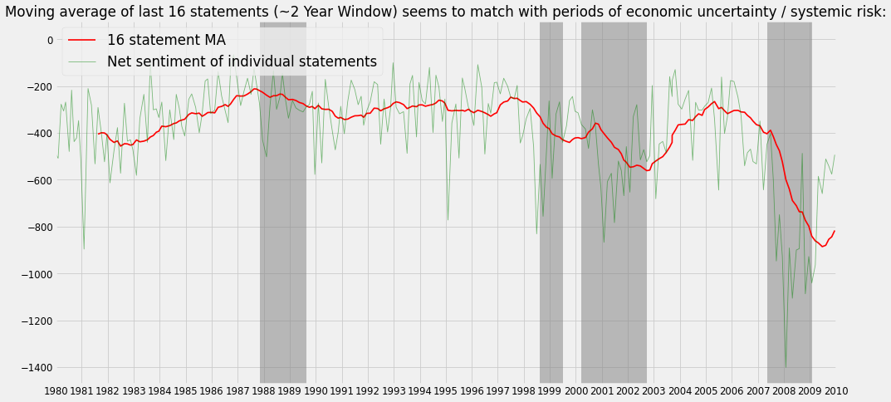

# FOMC_NLP_Sentiment_Analysis
Using spaCy and NLTK along with a Bag of Words approach, this notebook combed through 30 years FOMC minutes transcripts from 1980 to 2010 to determine sentiment over time.

### Overview
* 

### Code and Resources Used
Python Version: 3.7  
Environment: Google Colab  
Packages: pandas, numpy, spaCy, NLTK, sklearn, matplotlib, pdfplumber

### Data Cleaning
* 

### EDA

### Model Building
* 

### Model Performance

* 

