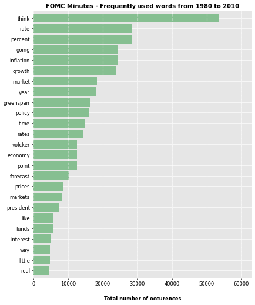
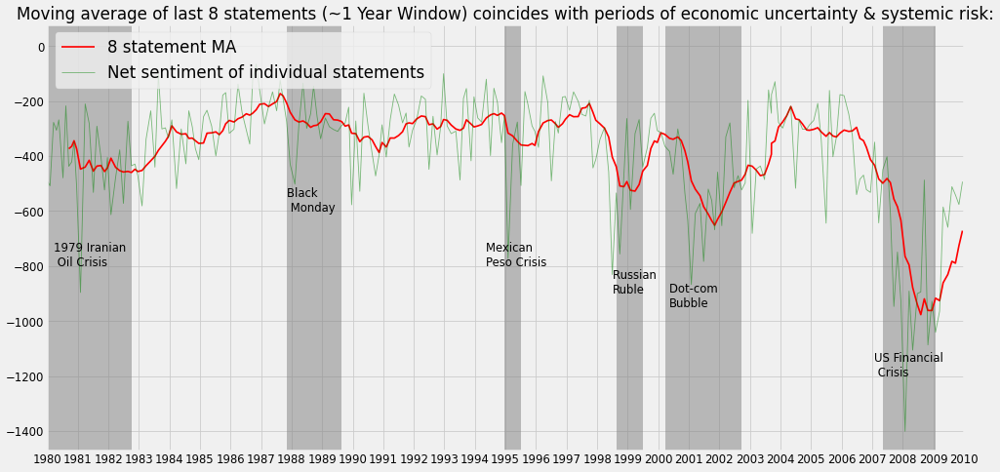
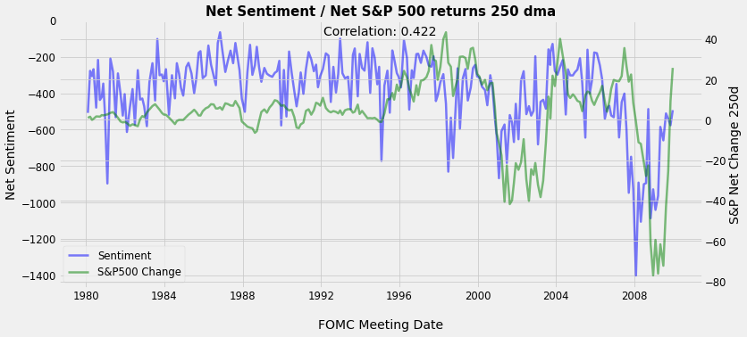

# FOMC_NLP_Sentiment_Analysis
Using spaCy and NLTK along with a Bag of Words approach, this notebook combed through 30 years FOMC minutes transcripts from 1980 to 2010 to determine sentiment over time.

### Overview
* Review FOMC transcripts over a 30 year period and determine trends and baseline to analyze future Fed commentary
* Relatively basic model that emphasizes scraping over 200 pdf files, tokenizing all non-stop words and categorizing each based on sentiment.
* Apply sentiment analysis to the words in the documents using the Loughran-McDonald context-specific lexicon.  This dictionary assigns a simple  value to words based on the financial services industry context.

### Code and Resources Used
Python Version: 3.7  
Environment: Google Colab  
Packages: pandas, numpy, spaCy, NLTK, sklearn, matplotlib, pdfplumber

### Data Cleaning
* Extracted pdfs from the Federal Reserve website (https://www.federalreserve.gov/monetarypolicy/)
* Then on my local computer organized each pdf into its respective publication year.  Separately each file was looped through in a list and scraped, preprocessed for html symbols and after removing common words was tokenzied.  
* Each file tokenized was put into a separate row in a consolidated dataframe.

### EDA

### Model Building
* 

### Model Performance
* 

